# Note.lat - AI-Powered Note Taking Platform

Note.lat is an intelligent note-taking platform that leverages cutting-edge AI technologies to transform audio lectures into organized, searchable notes with automated summaries and smart tagging.

## Features

### Audio Recording & Transcription
- Real-time audio recording of lectures and conversations
- High-accuracy speech-to-text conversion powered by OpenAI Whisper
- Support for multiple audio formats and languages

### AI-Powered Note Processing
- Automatic note summarization using LLaMA
- Intelligent title generation
- Smart tag extraction and categorization- Real-time processing and streaming responses

### User Management
- Secure user authentication and authorization
- University/institution-based organization
- Personal notebook management
- Course-specific note organization

### Data Storage & Management
- Neo4j graph database for efficient note organization
- Complex relationship mapping between notes, courses, and tags
- Fast search and retrieval capabilities
- Scalable data architecture

### Project Structure

```mermaid
graph TD
    Root[📁 note-app]
    Root --> App[📱 app]
    Root --> Public[📂 public]
    Root --> Screenshots[📸 screenshots]
    Root --> Config[⚙️ config files]

    App --> Components[🧩 components]
    App --> Pages[📄 pages]
    App --> Libs[🛠️ libs]
    App --> Fonts[🔤 fonts]
    App --> Styles[🎨 globals.css]

    Components --> C1[header.tsx]
    Components --> C2[recording.tsx]
    Components --> C3[sidebar.tsx]
    Components --> C4[demo.tsx]

    Pages --> P1[📝 create]
    Pages --> P2[🏠 dashboard]
    Pages --> P3[🔐 login]
    Pages --> P4[📋 notes]
    Pages --> P5[⚙️ settings]
    Pages --> P6[📝 signup]
    Pages --> P7[↪️ logout]

    Public --> Assets[🖼️ assets]
    Public --> Icons[📍 icons]

    Notes[📝 notes] --> N1[note.tsx]
    Notes --> N2[recommendation.tsx]
    Notes --> N3[notes.tsx]

    Config --> CF1[package.json]
    Config --> CF2[tsconfig.json]
    Config --> CF3[tailwind.config.ts]
    Config --> CF4[postcss.config.mjs]
```


## Screenshots
### Home


#### Mobile Home
<center>

</center>
#### User Logged In


### Demo


### Recording Interface
#### Recording Page without Login

#### Recording Page Idle

#### Recording In Progress

#### Recording finished


### Note Summary


### Login


#### Mobile Login
<center>

</center>

### Register


#### Mobile Register
<center>

</center>

#### University Selection


### Dashboard


#### Mobile Dashboard
<center>

</center>

#### Collapsable Sidebar
<center>

</center>

### Note Management


#### Tagging Notes


#### Search Notes


#### Note Details


### Note Recommendation


#### Navigate to Recommended Notes


### Settings


### Logout


### Not logged in


### Already Registered


## Technical Architecture

### Frontend
- Next.js for server-side rendering
- React for dynamic UI components
- Tailwind CSS for styling
- Real-time audio processing

### Backend
- Neo4j database for graph-based data storage
- OpenAI Whisper API integration
- LLaMA model integration
- RESTful API endpoints

### Key Features Implementation
- Streaming response handling for real-time transcription
- WebSocket integration for live updates
- Efficient blob handling for audio processing
- Secure user session management

## Getting Started

1. Clone the repository```
git clone https://github.com/365cent/note-app```

2. Install dependencies
```
npm install
```

3. Configure environment variables 

(not required)

4. Set up Neo4j database

Visit [neo4j-backend](https://github.com/MSomnia/neo4j-backend) for more information.

5. Run development server
```
npm run dev
```

## Credit
This project is built with the help of the following resources:
- [Neo4j](https://neo4j.com/)
- [OpenAI Whisper](https://github.com/openai/whisper)
- [LLaMA](https://github.com/facebookresearch/llama)
- [Next.js](https://nextjs.org/)
- [Tailwind CSS](https://tailwindcss.com/)
- [React](https://reactjs.org/)
- [Cloudflare](https://www.cloudflare.com/)
- [Vercel](https://vercel.com/)

Special thanks to:
- [MSomnia](https://github.com/MSomnia) for developing the Neo4j backend
- [Cloudflare Workers AI](https://developers.cloudflare.com/workers-ai/) for providing free credits for AI transcription and text generation


